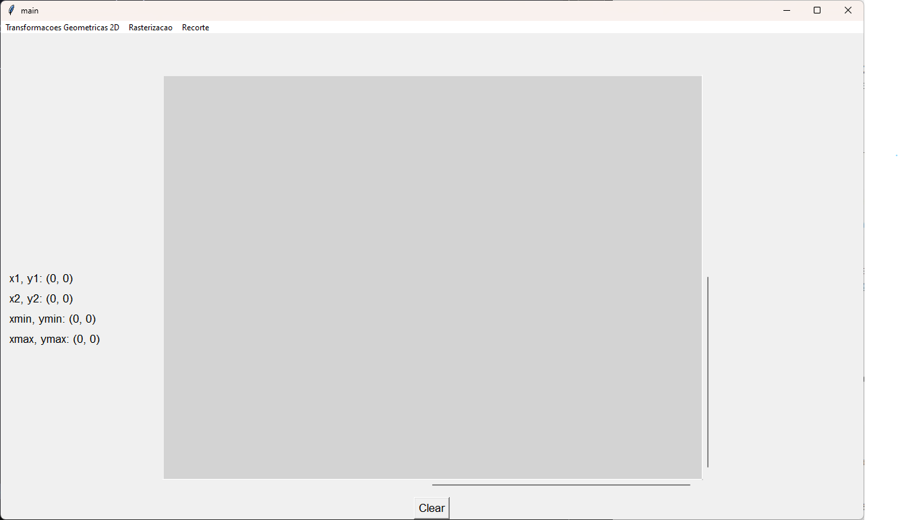
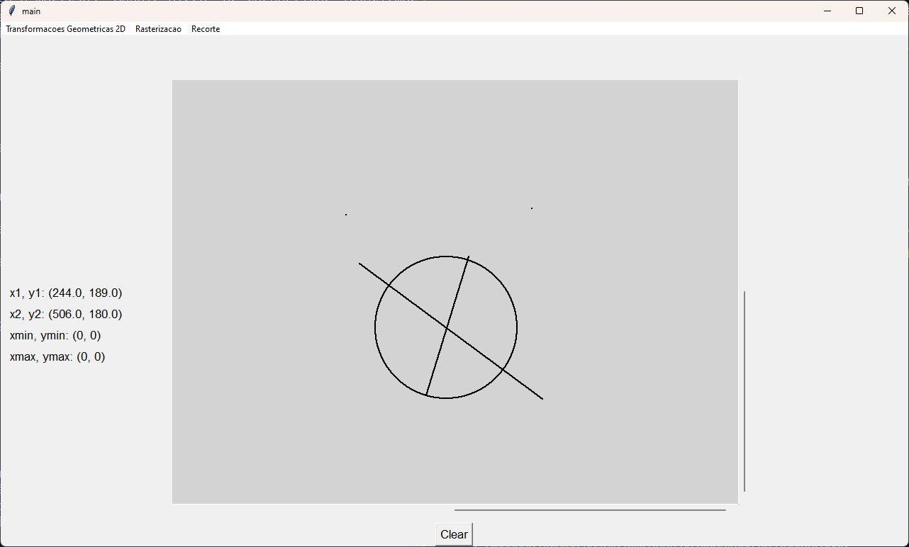
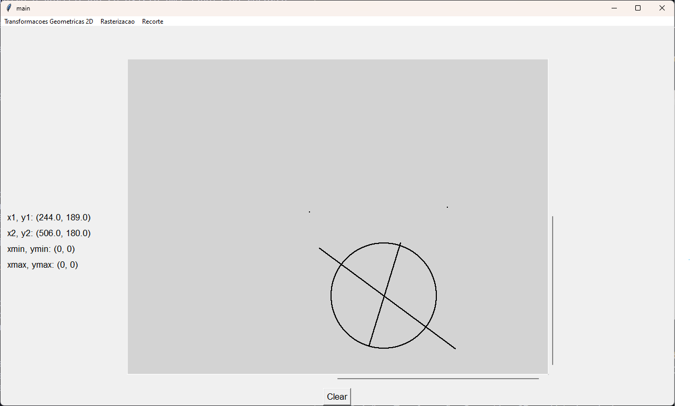
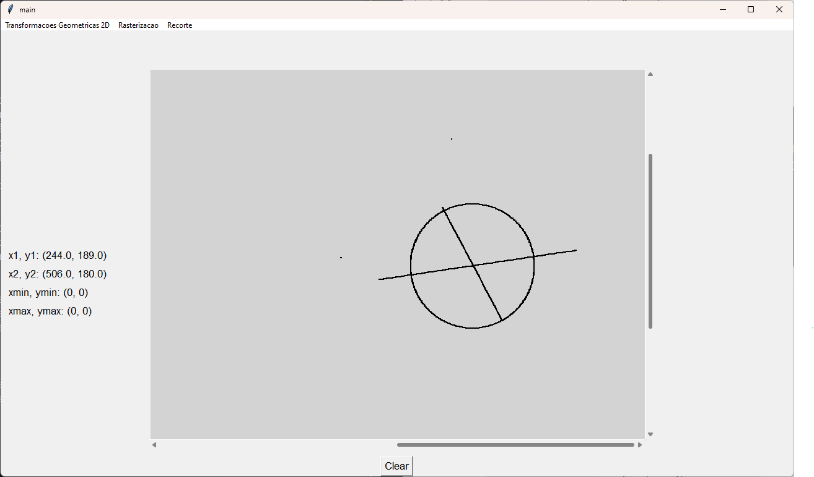
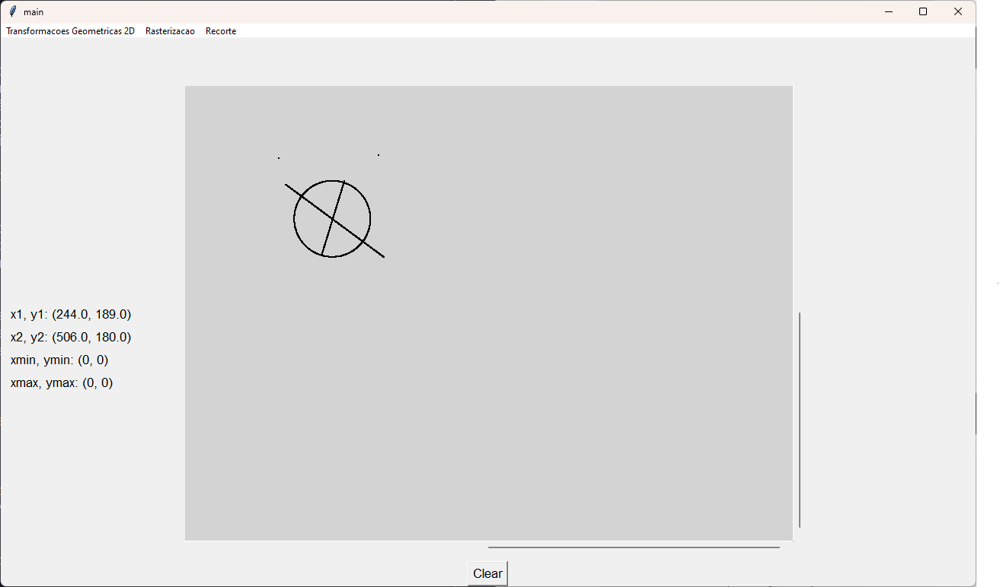
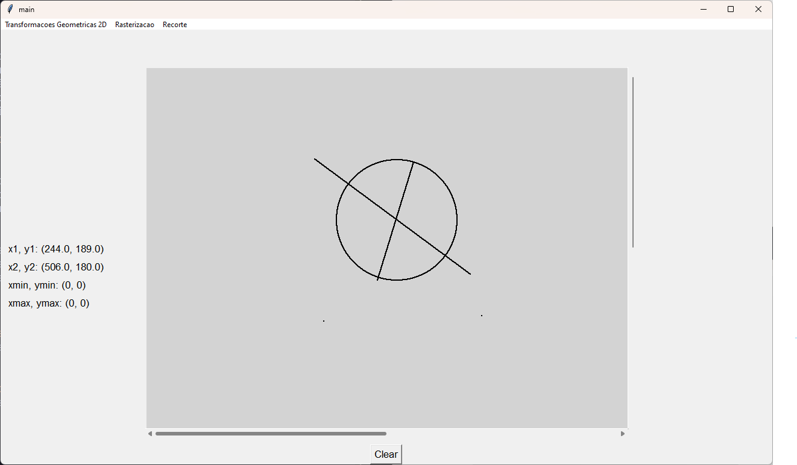
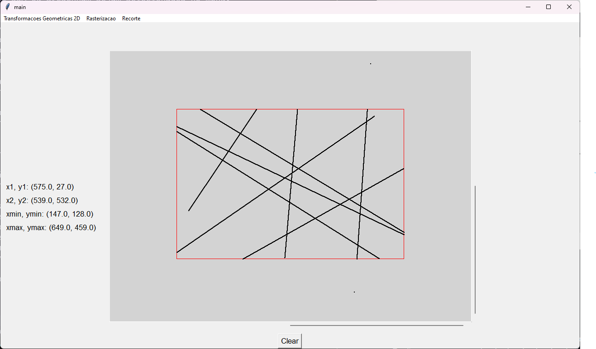

# Trabalho Prático de Computação Gráfica

Thiago Amado Costa

## Organização:

O código está organizado em 4 arquivos diferentes, específicos para cada caso:

### Main 

 
    *Tela inicial*

UI é feita com TKInter, utilizando um Canvas para o uso dos algoritmos, 
um Botão para limpar a tela, Labels para os pontos selecionados e 
menus de seleção para cada algoritmo.
O Canvas é configurado com uma scrollbar para ir às coordenadas negativas,
e inicia nas coordenadas ++.

A UI é configurada na classe Screen, no arquivo main.py. Essa classe é responsável pela 
construção dos elementos de UI, handlers de eventos e cliques.

Aqui também é mantida uma lista contendo todos os itens desenhados. 
Essa lista é composta por uma id, tipo do item (dependendo de qual algoritmo 
de desenho foi aplicado, DDA, Bresenham ou Circunferência-Bresenham), ponto 1,
ponto 2 e raio. No caso dos algoritmos de linha (DDA e Bresenham), o raio é 
setado como 0, e os pontos 1 e 2 como os respectivos pontos X e Y escolhidos pelo 
usuário. No caso do Circunferência-Bresenham, somente o ponto 01 é considerado, para 
ser o centro do circulo, e o raio é escolhido pelo usuário.


### Transformation

Algoritmos de Transformações 2D (Translação, Escala, Rotação, Reflexção)
, chamados pelo respectivo menu na UI. Todos os algoritmos são aplicados em cima da 
estrutura de dados descrita anteriormente, que mantém uma lista de todos os itens desenhados.

Na Translação, o usuário escolhe os valores que os objetos desenhados irão mover em
X e Y, somando esses valores nos pontos desenhados no Canvas 

Na Escala, o usuário escolhe os valores que os objetos desenhados irão escalar, 
multiplicando esses valores nos pontos desenhados no Canvas

Na Rotação, o usuário escolhe o valor do ângulo que os objetos desenhados irão 
rotacionar.

Na Reflexão, o usuário escolhe qual tipo de reflexão será aplicada nos objetos, 
reflexão X, Y ou XY


### Line Drawing 

Algoritmos de Rasterização (DDA, Bresenham, Circunferência-Bresenham), 
chamados pelo respectivo menu na UI, 
além de uma função para desenhar um pixel no canvas

Ao selecionar as opções no menu, primeiro é verificado se já existem pontos clicados no canvas.
Caso não houver, uma mensagem de aviso é mostrada. Depois disso, os respectivos algoritmos são chamados,
(DDA, Bresenham, Circunferência-Bresenham). No caso da Circunferência, apenas um ponto é necessário,
e o usuário precisa de informar o raio do circulo.

Antes da execução dos algoritmos, a lista de itens descrita anteriormente é atualizada,
para manter o novo objeto em memória.

Os algoritmos são os mesmos mostrados nos slides da disciplina.


### Clipping 

Algoritmos de Recorte (Cohen-Sutherland e Liang-Barsky),
chamados pelo respectivo menu na UI.

Ao selecionar as opções no menu, primeiro é verificado se existe uma janela de recorte,
que deve ser selecionada com o botão direito. Caso exista, chama o respectivo algoritmo com 
os pontos 1 e 2 selecionados no canvas, sempre com 02 pontos por vez.

Os algoritmos são os mesmos mostrados nos slides da disciplina, e são aplicados
em cima da lista de itens desenhados na tela.

## Como Usar: 

***Requerimentos*** : git, python v >= 3.9, tkinter, math

***Modo de Execução***:

- clone o repositório (ou baixe como zip)

```
git clone git@github.com:ThiiagoAC7/tp1-comp-grafica.git
ou 
git clone https://github.com/ThiiagoAC7/tp1-comp-grafica.git
```
- no repositório, execute o arquivo main.py
```
python main.py
```
***Como utilizar***:

1. Desenhe objetos na tela utilizando os algoritmos de Rasterização:
    - selecione 02 pontos na tela com o clique esquerdo do mouse, 
    e selecione o menu de Rasterização, para aplicar DDA ou Bresenham.
    - selecione 01 ponto na tela no caso de Circunferência-Bresenham 
    e informe o raio da circunferencia.

     
        *Objetos desenhados no canvas*

Na imagem acima, um exemplo de objeto desenhado utilizando os algoritmos.
Observação para os 02 pixels desenhados acima do objeto, que pode virar 
uma linha caso DDA ou Bresenham sejam selecionados no menu.


2. Aplique Transformações Geometricas 2D no objeto desenhado:
    - selecione no menu de transformações o algoritmo desejado, 
    informe os valores desejados e veja o resultado.
    - Exemplos :

     
        *Exemplo : Translação de 100,100 no objeto*

     
        *Exemplo : Rotação de -45 graus no objeto*

     
        *Exemplo : Escala de 0.5 no objeto*

     
        *Exemplo : Reflexão XY no objeto*

3. Aplique os algoritmos de Recorte:
    - Desenhe objetos na tela, com DDA ou Bresenham 
    - Com o botão direito, selecione os pontos min e max, responsáveis
    pela janela de recorte. (retangulo em vermelho)
    - No menu recorte, selecione o algoritmo desejado (Cohen-Sutherland ou 
    Liang-Barsky)
    - Repita o processo caso desejar (mudando a janela de recorte ou não)
    - Exemplo:

     
        *Exemplo : Recorte nos objetos*
